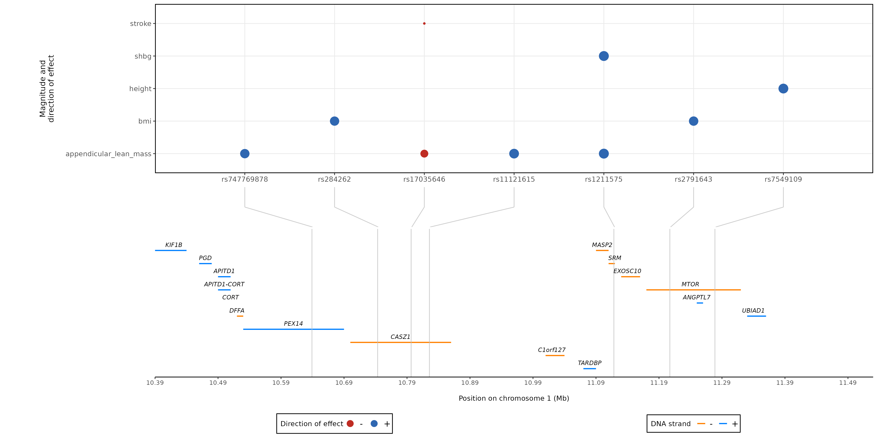

# Multiple traits colocalisation and fine mapping
<br>

## Description
Performs:

1) Loci identification:\
    1.1) Identification of trait-specific loci\
    1.2) Collapsing of across traits overlapping loci into larger genomic regions

2) Association signals​ untangling​\
    2.1) Identification of independent association signals​ by trait\
    2.2) Leave-one-out approach to “clean” single association signal

3) Finemapping of likely causal variant(s) 

4) Traits colocalisation
<br>
<br>
<br>

## Setting up
Navigate to your project folder:\
`cd your_project_folder`

Clone this repository:\
`git clone -b development https://github.com/ariannalandini/prj_008_multi_coloc_dev.git`

Create a `logs` directory (**REQUIRED**):\
`mkdir logs`

Create conda environment:\
`conda env create -f ./prj_008_multi_coloc_dev/coloc_pipe_env.yml`
<br>
<br>

## Required inputs

**1) GWAS summary statistics**

GWAS summary statistics should use identical column names, irrespective of whether the columns are in a different order or not all columns are present in every set of summary statistics. Additionally, the summary statistics must be based on the same human genome build (either 37 or 38).


| CHROM | GENPOS | ID           | ALLELE0 | ALLELE1 | A1FREQ | N      | BETA    | SE     | LOG10P |
|-------|--------|--------------|---------|---------|--------|--------|---------|--------|--------|
| 1     | 10894	 | 1:10894      | A       | G       | 0.9993 | 367458 |  0.0368 | 0.0763 | 0.2011 |
| 1     | 11171	 | 1:11171      | C       | CCTTG   | 0.9588 | 367458 |  0.0005 | 0.0109 | 0.0161 |
| 1     | 13973	 | 1:13973      | C       | T       | 0.9997 | 367458 | -0.0866 | 0.1608 | 0.229  |
| 1     | 14003	 | 1:14003      | T       | C       | 0.9998 | 367458 | -0.0498 | 0.1627 | 0.1194 |
| 1     | 14022	 | 1:14022      | A       | G       | 0.9998 | 367458 |  0.0461 | 0.1777 | 0.0993 |
| 1     | 23197	 | rs1220638906 | T       | TTAAAA  | 0.9942 | 367458 | -0.038  | 0.0285 | 0.7407 |
<br>
<br>

**2) Loci table**

A "guide" table reporting which genomic regions and traits to test for colocalisation. 

MANDATORY info (using the below listed column names):

- chr: chromosome number 
- start: starting position of the genomic region of interest
- end: ending position of the genomic region of interest
- trait: name of the associated trait, which will be used in all outputs
- path: path and file name of the GWAS summary statistics file for that trait - **\*.tsv and \*.gz are the file extensions currently accepted**
- type: the type of trait, either "quant" for quantitative traits or "cc" for case-control study\
    if type=="cc"
    - s: for a case-control study, the proportion of samples that are cases (MANDATORY) \
    if type=="quant" and it is known
    - sdY: for a quantitative trait, the population standard deviation of the trait (OPTIONAL - if not given, it will be estimated from the variance of beta and MAF)

MANDATORY info that can be either provided in the table or as script options (see "Options in details"):
- grch: human genomic build of provided GWAS summary statistics (GRCh 37 and 38 are supported at the moment). **NB: All traits having an association in the same locus MUST have the same build!**

CUSTOMIZABILE **NOT** MANDATORY info that can be either provided in the table as script options (see "Options in details"):
- bfile: Path and prefix name of custom LD reference panel bfiles (PLINK format .bed .bim .fam)
<br>
<br>

| chr | start     | end       | trait    | path                            | type  | sdY  | s    | grch |             bfile            |
|-----|-----------|-----------|----------|---------------------------------|-------|------|------|------|------------------------------|
| 1   | 11740966  |	11760802  | height   | /group/gwas/height_gwas.cvs.gz  | quant | 0.45 | NA   |  37  |              NA              |
| 1   | 11740966  |	11760802  | bmi      | /random_path/my_gwas_bmi.tsv    | quant | 1.2  | NA   |  37  |              NA              |
| 1   | 17273822  | 17348042  | mpv      | /test/mpv.txt.gz                | quant | 0.02 | NA   |  38  |              NA              |
| 1   | 20560648  | 21242860  | diabetes | /shared/folder/diabetes_103.tsv | cc    | NA   | 0.1  |  37  |   /path/to/different_ld_ref  |
| 1   | 28183819  | 28850273  | hbg      | /group/gwas/hgb_gwas.cvs.gz     | quant | 0.01 | NA   |  37  |   /path/to/different_ld_ref  |
| 1   | 117583999 | 117640170 | height   | /group/gwas/height_gwas.cvs.gz  | quant | 0.45 | NA   |  38  |              NA              |
| 1   | 117583999 | 117640170 | cvd      | /all_gwas/my_sample_cardio.tsv  | cc    | NA   | 0.36 |  38  | /path/to/ld_ref_plink_format |
<br>


The loci table can be either produced by using the `p09_locus_breaker.sbatch` and `p10_locus_lister.sbatch` scripts or can be directly provided by the user.

**!!! VERY IMPORTANT !!!**\
When generating the loci table using the `p09_locus_breaker.sbatch` and `p10_locus_lister.sbatch` scripts, it should be noted that the columns labeled as `type`, `sdY` and/or `s`, `grch` and `bfile` (if required) will **not** be automatically incorporated into the resulting table, ***unless*** these columns are already present in the GWAS summary statistics file.
In cases where users opt to not modify the GWAS summary statistics, the `type`, `sdY`, and/or `s`, `grch` and `bfile` columns needs to be manually appended to the table produced by the `p10_locus_lister.sbatch` script. This action should be carried out before running the `p11_multi_coloc.sbatch` script.
<br>
<br>


**3) LD reference**\
Custom LD references can be provided in plink format (.bed, .bim, .fam), and  can be either specified in the input loci table (higher flexibility, allows for multiple, GWAS-specific, LD references) or as script option (fast and easy for one-fits-all LD reference). Please note that the GWAS summary statistics and the corresponding LD reference should be expressed in the same human genome build.
Please check [this link](https://yanglab.westlake.edu.cn/software/gcta/#COJO) for raccomandations regarding the choice of reference sample for GCTA-COJO analysis.

By default, LD reference from 30k UKBB TOPMed imputed genotypes will be used.
<br>
<br>
<br>

## Quick start

To obtain trait-specific loci, provide the path where your GWAS summary statistics are located as argument to the `--path` option in the `p09_locus_breaker.sbatch`
```
Rscript --vanilla prj_008_multi_coloc_dev/scripts/locus_breaker_wrap.R \
--path "/path/to/GWAS/summary/statistics/directory"
```
Then run specifying the number of traits (29 in this example)
```
sbatch ./prj_008_multi_coloc_dev/cntl/p09_locus_breaker.sbatch --array=1-29
```
To define the boundaries of genomic regions aggregating multiple traits overlapping loci, provide the path where your trait-specific loci are located as argument to the `--loci_path` option in the `p10_locus_lister.sbatch`

```
Rscript prj_008_multi_coloc_dev/scripts/locus_lister_wrap.R \
--loci_path "/path/to/trait/specific/loci/table/directory"
```
Then run
```
sbatch ./prj_008_multi_coloc_dev/cntl/p10_locus_lister.sbatch
```
Finally, run pairwise colocalisation analysis for all your traits by providing the path where your pan loci table is located as argument to the `--input` option in the `p11_multi_coloc.sbatch`

```
Rscript --vanilla prj_008_multi_coloc_dev/scripts/multi_coloc_wrap.R \
--input "/path/to/overlapping/genomic/regions/table/name_of_your_table.tsv"
```
Then run specifying the number of pan loci (1328 in this example)
```
sbatch ./prj_008_multi_coloc_dev/cntl/p11_multi_coloc.sbatch --array=1-1328%100
```
<br>
<br>
<br>

## Example

The `example-data` folder contains the GWAS summary statistics for BMI, height, stroke, sex hormone binding globulin (SHBG) and appendicular lean mass (originally downloaded from the [IEU OpenGWAS project](https://gwas.mrcieu.ac.uk/), with study ids ukb-b-2303, ieu-a-89, ebi-a-GCST005838, ieu-b-4870 and ebi-a-GCST90000025), filtered, for the sake of this tutorial, for a specific region in chromosome 1 (from 10546866 to 11576788 bp).
The same folder contains also the LD reference panel from UKBB (GRCh37), in plink format files, filtered for the same region.

GWAS summary statistics have been formatted to include not only standard info (CHROM, GENPOS, ID, ALLELE0,ALLELE1, A1FREQ, N, BETA, SE and LOG10P), but also columns later needed for the colocalisation analysis: trait, path, type, sdY, s, grch and bfile.

As described above, you'll need first to clone the git repository and conda environment
```
### Perform the test analysis in "example-data_test" directory
mkdir -p example-data_test/logs
cd example-data_test
git clone -b development https://gitlab.fht.org/biostatistics-unit/prj_008_multi_coloc_dev.git
conda env create -f ./prj_008_multi_coloc_dev/coloc_pipe_env.yml
```
<br>

Few adjustment are needed before starting right away:

1) You might need to add in `prj_008_multi_coloc_dev/cntl/p09_locus_breaker.sbatch`, `p10_locus_lister.sbatch` and `p11_multi_coloc.sbatch` files the path to the conda environment `coloc_pipe_env` you just created:
```
conda activate /path/to/cond/env/coloc_pipe_env
```
<br>

2) In `p11_multi_coloc.sbatch`, you need to specify the paths to the following softwares  
```
    --tabix_bin "/path/to/software/htslib-tools/1.14/tabix" \
    --plink2_bin "/path/to/software/plink/2.00_20211217/plink2" \
    --gcta_bin "/path/to/software/GCTA/1.94.0beta/gcta64"
```
<br>

Now you're ready to go!

1) To identify trait-specific association loci, run:
```
sbatch ./prj_008_multi_coloc_dev/cntl/p09_locus_breaker.sbatch
```
For each trait, a loci table will be generated in the `example-data/p09_locus_breaker` folder. As example, this how the `height_loci.tsv` should look like:

| chr |   start  |    end   |  GENPOS  |     ID     | ALLELE0 | ALLELE1 | A1FREQ |   N    |  BETA  |   SE   |  LOG10P |  trait |                                  path                                 | type  | sdY | s  | grch |                                  bfile                                 |   P   |
|-----|----------|----------|----------|------------|---------|---------|--------|--------|--------|--------|---------|--------|-----------------------------------------------------------------------|-------|-----|----|------|------------------------------------------------------------------------|-------|
|  1  | 11102275 | 11326788 | 11284336 | rs10779751 |    A    |    G    | 0.708  | 253192 | -0.021 | 0.0032 | 9.69897 | height | ./prj_008_multi_coloc_dev/example-data/height.1_10546866_11576788.tsv | quant | NA  | NA |  37  | ./prj_008_multi_coloc_dev/example-data/ukbb_1_10546866_11576788_grch37 | 2e-10 |
<br>

2) To collapse trait-specific loci, overlapping across multiple traits, into a single genomic region, run:
```
sbatch ./prj_008_multi_coloc_dev/cntl/p10_locus_lister.sbatch
```
 Here how the genomic regions table `p10_locus_lister/example-data_all_loci.tsv ` should look like:

| chr |   start  |    end   |  GENPOS  |      ID      | ALLELE0 | ALLELE1 | A1FREQ |   N    |   BETA  |   SE   |  LOG10P |          trait         |                                          path                                         | type  | sdY |   s   | grch |                                  bfile                                 |     P    | pan_locus |    pan_locus_name   |
|-----|----------|----------|----------|--------------|---------|---------|--------|--------|---------|--------|---------|------------------------|---------------------------------------------------------------------------------------|-------|-----|-------|------|------------------------------------------------------------------------|----------|-----------|---------------------|
|  1  | 11102275 | 11326788 | 11284336 |  rs10779751  |    A    |    G    | 0.708  | 253192 | -0.021  | 0.0032 | 9.69897 |         height         |         ./prj_008_multi_coloc_dev/example-data/height.1_10546866_11576788.tsv         | quant |  NA |   NA  |  37  | ./prj_008_multi_coloc_dev/example-data/ukbb_1_10546866_11576788_grch37 |  2e-10   |     1     | 1_10547263_11387192 |        |
|  1  | 10547263 | 11387192 | 11129317 |  rs2791654   |    G    |    A    | 0.7062 | 450243 | -0.0239 | 0.0022 | 27.9187 | appendicular_lean_mass | ./prj_008_multi_coloc_dev/example-data/appendicular_lean_mass.1_10546866_11576788.tsv | quant |  NA |   NA  |  37  | ./prj_008_multi_coloc_dev/example-data/ukbb_1_10546866_11576788_grch37 | 1.21e-2  |     1     | 1_10547263_11387192 |
|  1  | 10719645 | 11360957 | 11207269 |  rs2791643   |    C    |    T    | 0.7618 | 454884 | -0.0129 | 0.0023 | 7.55284 |           bmi          |           ./prj_008_multi_coloc_dev/example-data/bmi.1_10546866_11576788.tsv          | quant |  NA |   NA  |  37  | ./prj_008_multi_coloc_dev/example-data/ukbb_1_10546866_11576788_grch37 | 2.81e-8  |     1     | 1_10547263_11387192 |
|  1  | 11067792 | 11365015 | 11126941 | rs1279191368 |    C    |    T    | 0.7428 | 214989 | -0.0231 | 0.0034 | 11.1805 |          shbg          |          ./prj_008_multi_coloc_dev/example-data/shbg.1_10546866_11576788.tsv          | quant |  NA |   NA  |  37  | ./prj_008_multi_coloc_dev/example-data/ukbb_1_10546866_11576788_grch37 | 6.6e-12  |     1     | 1_10547263_11387192 |
|  1  | 10787538 | 10799577 | 10796866 |   rs880315   |    T    |    C    |   0.4  | 446696 |  0.0527 | 0.0084 | 9.44141 |         stroke         |         ./prj_008_multi_coloc_dev/example-data/stroke.1_10546866_11576788.tsv         |  cc   |  NA | 0.091 |  37  | ./prj_008_multi_coloc_dev/example-data/ukbb_1_10546866_11576788_grch37 | 3.62e-10 |     1     | 1_10547263_11387192 |

While `start` and `end` identify the original boundiares of the trait-specific locus, `pan_locus_name` reports the boundaries of the genomic region, overlapping and including all trait-specific loci having the same `pan_locus`

<br>

3) Finally, to perform colocalisation and finemapping of all traits included in each genomic region previsouly identified, run:
```
sbatch ./prj_008_multi_coloc_dev/cntl/p11_multi_coloc.sbatch
```

The final outcome can be summarised by the following plot:



Each dot in the top panel represent the effect size and direction of the most likely causal SNP for that association signals. Multiple dots on the same horizontal line indicate that, for the same trait reported on the y axis, multiple independent association signal have been found in the same genomic regions. Multiple dots aligned on the same vertical line indicate that association signals colocalise (PPH4 > 0.9) accross multiple traits.

In this example, the complex association pattern has been "broken down" into multiple independent signals for bmi and appendicular lean mass, while height, stroke and shbg report only one association signal. One signal from appendicular lean mass colocalises (PPH4 > 0.9) with stroke's association signal (representative SNP rs17035646), while another (independent) signal from appendicular lean mass with shgb (representative SNP rs1211575). In both cases, they have consistent direction of effect.

<br>
<br>

## Options in details

1) `p09_locus_breaker.sbatch` : identification of trait-specific loci

To identify the associated loci specific to each trait in a list, run the **`prj_008_multi_coloc_dev/cntl/p09_locus_breaker.sbatch`** script, providing:\
    `--path`: path to directory or multiple (comma separated) directories where GWAS summary statistics for all your traits of interest are located.\
Note this is the only essential option, if not provided the script will throw an error and stop.\
    `--pref`: prefix to the trait name of provided GWAS summary statistics\
    `--suf`: suffix to the trait name of provided GWAS summary statistics\
Prefix and suffix are necessary to extract only the trait name (e.g. "height", "bmi", etc.) from your GWAS summary statistics file names. Of course, this assumes that all files have been named following the same logic.\
    `--out`: path to the (single) directory where output loci tables will be stored. \
    `--chr`: Name of chromosome column in GWAS summary statistics (default: CHROM)\
    `--pos`: Name of genetic position column in GWAS summary statistics (default: GENPOS)\
While all the listed options are quite relevant, they are not strictly essential: for example, if your GWAS summary statistics have been created using the [GAU Regenie pipeline](https://gitlab.fht.org/genome-analysis-unit/nf-pipeline-regenie) and you are happy with having a `"loci_identification"` directory created in the parent directory of your input folder, then you are fine with defaul arguments.\
    `--pvalue`: Name of p-value of effect column in GWAS summary statistics (default: LOG10P)\
This can either be the raw p-value or the log10 transformed one.\ 
    `--sig_pval`: Significant p-value threshold for top hits (default:5e-08)\
    `--limit`: P-value threshold for loci borders (default: 1e-05)\
    `--hole`: Minimum pair-base distance between SNPs in different loci (default: 250000)

Finally, specify the number of traits (whose GWAS summary statistics are present at the input path) for which the script should be run in the `#SBATCH --array` option.
<br>


2) `p10_locus_lister.sbatch` : collapsing of across traits overlapping loci into larger genomic regions

To collapse overlapping loci from multiple traits into genomic regions, run the **`prj_008_multi_coloc_dev/cntl/p10_locus_lister.sbatch`** script, providing:\
    `--loci_path`: path to directory where all trait-specific loci table created by the previous step are stored.\
Note this is the only essential option, if not provided the script will throw an error and stop.\
    `--out`: Path to and name of the pan loci file.\
<br>


3) `prj_008_multi_coloc_dev` : running colocalisation analysis and fine mapping

To perform association signals​ untangling, colocalisation and fine mapping, run the **`prj_008_multi_coloc_dev/cntl/p11_multi_coloc.sbatch`** script, providing:\
    `--input`: path and name of the pan loci table previously created.\
    `--grch`: Genomic build of GWAS summary statistics (default: 38) \
Note these are the only options with no default, if not provided the script will throw an error and stop.\
    `--output` "coloc/multi_coloc" \
    `--chr`: Name of the chromosome column in GWAS summary statistics (default: CHROM)\
    `--pos`: Name of the genetic position column in GWAS summary statistics (default: GENPOS)\
    `--rsid`: Name of the rsid column in GWAS summary statistics (default: ID) \
    `--a1`: Name of the effect allele column in GWAS summary statistics (default: ALLELE1)\
    `--a0`: Name of the non effect allele column in GWAS summary statistics (default: "ALLELE0") \
    `--freq`: Name of the effect allele frequency column in GWAS summary statistics (default: "A1FREQ") \
    `--n`: Name of the sample size column in GWAS summary statistics (default: "N") \
    `--effect`: Name of the effect size column in GWAS summary statistics (default: "BETA") \
    `--se`: Name of standard error of effect column in GWAS summary statistics (default: "SE") \
    `--pvalue`: Name of p-value of effect column in GWAS summary statistics (default: "P") \
    `--maf`: Minor allele frequency (MAF) thershold removing variants below the set threshold from the analysis (default: 0.0001) \
    `--bfile`: Path and prefix name of custom LD reference bfiles (PLINK format .bed .bim .fam) (default: LD reference from 30k UKBB TOPMed imputed genotypes). **NB:**this option will be overriden if LD reference bfiles are provided also in the input loci table \
    `--save_inter_files`: Whether to save intermediate munged summary statsistics and condiotioned datasets as R objects (default: FALSE) \
    `--tabix_bin`: Path to tabix software \
    `--plink2_bin`: Path to plink2 software \
    `--gcta_bin`: Path to GCTA software

Finally, specify the number of genomic regions (identified in the previous step) for which the script should be run in the `#SBATCH --array` option.
<br>
<br>


## Description of outputs

**Results:**\
locus_15_final_locus_table.tsv\
Reporting all independent association signals identified for each trait and their 99% credible set.

locus_15_colocalization.table.all.tsv\
Reporting summary results for all pairwise coloc tests performed.

locus_15_colocalization.table.H4.tsv\
Reporting summary results for pairwise coloc tests performed having PPH4 > 0.9.


**Plots:**\
locus_15_conditioned_loci.pdf\
Visualising the assocation pattern "dissecting" process for each tested trait.

locus_15_pleiotropy_table.pdf

locus_15_colocalization_plot.pdf\
Regional Manhattan plot of colocalising traits.

locus_15_results_summary_plot.png\
Reporting all independent signals and traits associated at the locus, summarising the colocalising ones and placing them in the context of the chromosome (with genes annotation).
<br>
<br>


## References
 - [Giambartolomei C, Vukcevic D, Schadt EE, Franke L, Hingorani AD, Wallace C, et al. Bayesian test for colocalisation between pairs of genetic association studies using summary statistics. PLoS Genet. 2014;10(5):e1004383](https://doi.org/10.1371/journal.pgen.1004383)
 - [Yang J, Ferreira T, Morris AP et al. . Conditional and joint multiple-SNP analysis of GWAS summary statistics identifies additional variants influencing complex traits. Nat. Genet. 2012;44(4):369–375,S1–S3](doi:10.1038/ng.2213)
<br>
<br>


## Authors and acknowledgment
Nicola Pirastu ([nicola.pirastu@fht.org](nicola.pirastu@fht.org))\
Arianna Landini ([arianna.landini@external.fht.org](arianna.landini@external.fht.org))\
Sodbo Sharapov ([sodbo.sharapov@fht.org](sodbo.sharapov@fht.org))
<br>
<br>


## To do

General:
- ~~Create conda environment for R packages needed (easyGgplot2 and ggnet are the only packages not supported in conda. easyGgplot2 really needed? May ggnet be replaced by ggnetwork?)~~ DONE
<br>

Locus identification:
- Add more possible file extension to the GWAS format in `p09_locus_breaker.sbatch`\
- ~~Include in `locus.breaker` function the possibility of providing LOG10 p-value~~ DONE
<br>

Coloc (ideally in priority order?):
- ~~Possibility to provide costume LD reference~~ DONE
- Add cojo raw --> check if this solves issue with traits "bridging" colocasation between traits clearly not colocalisaing, creating a fake colocalisaing sub locus
- Check for missing SNPs across different population GWAS - if they do not interset in the cs beacuse they're not at ALL in some datasets, they should NOT be removed from the cs intersection
- Write from scratches cojo joint (coloc --cond is NOT a joint model)
<br>

- Include effect allele frequency in the final summary plot (next to SNP label)
- Add legend/scale of effect size in the final summary plot
- Cluster/rank traits by correlation in the final summary plot
- Check munging function to set "essential" info and "optional" info (code will run anyway if only essential info are provided)
- ~~What about COJO collinearity? --> Use tryCatch()~~ DONE
- Improve naming consistency:
    1) pan.locus and sub_locus --> either use "." or "_"
    2) sub loci are somentimes called "sub_locus" and sometimes "g1"
- ~~Include example data to test the pipeline?~~ DONE
- ~~Patch `coloc.abf()` function to account for sample overlap~~ No need according to Sodbo's simulations
- ~~Slim down output files? --> Implement new p-value filter~~ DONE
- ~~Include possibility to perform coloc on a specified custom region (skipping locus.breaker and locus.lister steps)~~ DONE - possible to skip p09 and p10 steps and provide costum loci table
